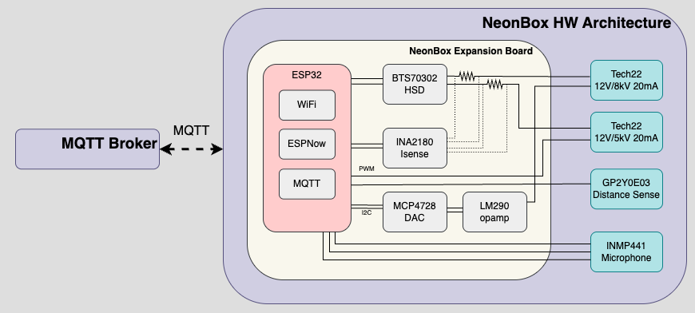

# overview
## introduction
Stool Two is a run-of-the-mill bar stool trimmed out with an array of neon lights. One light for each leg, and one for the outer perimeter of the seat, and one for the inner perimeter. Stool Two is powered by a NeonBox, which is a battery powered controller that sits out of sight under the seat, giving the illusion of a standalone glowing stool. 

)

## motivation
Stool Two was an experiment in what throwing neon at a mundane object might end up looking like. The stool itself is entirely impractical from a cost and utility perspective, but it paved a thought path in thinking about how a world could look if everything was neon-ified (rather than [chrome-ified](https://www.youtube.com/watch?v=TuK5mlW9svQ)).

While not technically challenging in any way, I also wanted to experiment with battery-powering a neon piece as its often a medium that is installed on a surface and plugged in for its lifetime. Being able to move Stool Two around the house, or even out of the house, tests the limits of where and how one typically expects to see neon glowing.

## design
### Stool
The stool itself is counter stool sold by [Staples](https://www.staples.com/flash-furniture-kai-industrial-metal-counter-stool-without-back-silver-ch3132024sil/product_1983295). The green one is no longer listed but the one linked is the same model.

#### stool with neonbox

### NeonBox
Architecturely, the NeonBox is largely inspired by the NeonRotator from [WallFlower](https://github.com/mverrecchia/wallflower), but with a few key differences. Here's whats inside:
- [ESP32S3 DevKitC-1](https://docs.espressif.com/projects/esp-dev-kits/en/latest/esp32s3/esp32-s3-devkitc-1/index.html) + custom expansion board
- [Tech22 12VDC/5kVAC Power Supply](https://www.t2-neonpower.com/PRODUCTS/NEON_SUPPLIES/5000_12_files/5000-12.html)
- [Tech22 12VDC/8kVAC Power Supply](https://www.t2-neonpower.com/PRODUCTS/NEON_SUPPLIES)
- [12 5500mAh RC Battery](https://a.co/d/334M3Gx)
- [Sharp Socle Optical Distance Sensor](https://www.digikey.com/short/bzfhv5wd)

<!-- 

exploded view
 -->
#### exploded view

<!-- 
 -->

### hw architecture
The primary difference is that the NeonBox is an independently operable unit that does not require a manager board. The manager and controller are one in the same. 

Like the NeonRotator, the NeonBox's expansion board serves primarily to control the neon power supplies, but also does a few other things. There are two power supplies: one for the "outer" neon (the legs and the outer ring), and one for the "inner" neon (the inner ring under the seat). Given the overall amount of neon being powered, the outer neon requires an 8kV supply, while the inner neon requires a 5kV supply. The 8kV supply is brightness-controlled through the use of a PWM signal, while the 5kV supply is controlled through a 0-12V signal. Similarly, the expansion board uses a DAC to produce a 0-3.3V signal that gets amplified to 0-12V. In addition to the supply control, the expansion board also handles inputs from buttons, a potentiometer, a distance sensor, and manages communication with a microphone.

<!-- Photo of HW architecture -->
<!-- 

architecture
 -->

<!-- 
 -->

<!-- Stool rotator expansion board -->

expansion board model

[expansion board schematic](media/stool_schematic.pdf)

## sw architecture
I initially intended the NeonStool SW architecture to mirror what the NeonRotator was doing in order to share source code as much as possible, but I gave up on that pursuit after some hairpulling. Rearchitecting NeonManager to host NeonController members to run on the same ECU is entirely doable but I didn't want to dump too much time into it. If I were to make another NeonBox for another project, I would try again, but for now I'm fine with the code block copy/paste mishmash. So for now, NeonManager is extended out to be a both the manager and controller. It manages all wireless connectivity and microphone comms as the NeonRotator's manager does, but it also handles power supply control and distance sensor monitoring. Similar to NeonRotator, FreeRTOS powers Stool Two with a task-based concurrent system that distributes its functionalities across the ESP32S3's dual processor cores, with dedicated tasks for MQTT communication / WiFi connectivity, sensor monitoring, manager / controller operations. The architecture utilizes FreeRTOS mutexes to ensure thread-safe operation while maintaining deterministic timing for the main control loops.

### Development Environment
This project was brought up using PlatformIO's VSCode extension, and leveraged ESP32's SDK and Arduino framework. 
